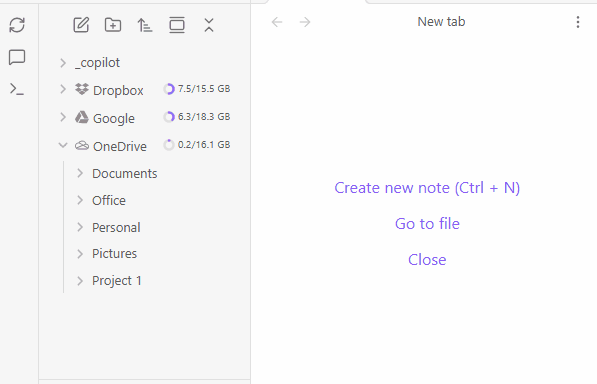
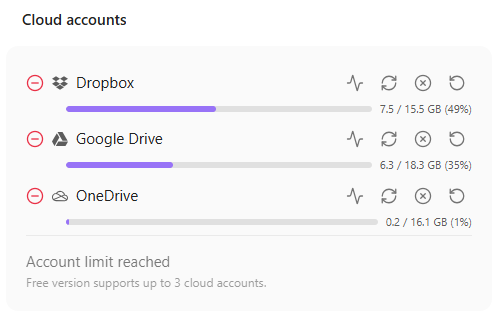
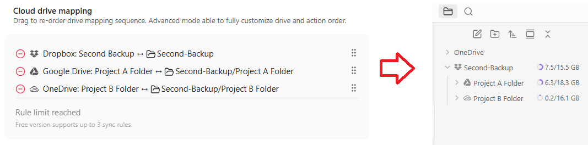

Optimizing tool selection...Here is a revised and more polished version of your README introduction and feature list, with improved grammar and clarity. I have also completed any incomplete sentences and enhanced the flow for better readability:

---

# 🔄 Obsidian MultiSync

> **Sync individual vault folders with multiple cloud drives — simultaneously.**

⚠️ **Disclaimer:** This plugin modifies files in your vault and cloud storage. **Always maintain offline backups.** The author is not responsible for any data loss.

---

Painful drive management and content migration? With this plugin, you can simply drag and drop content for easy migration.

This plugin allows you to map cloud drives to Obsidian, similar to other plugins, but with the added ability to mount multiple cloud and local folders, including subfolders within the cloud. I use it to efficiently manage my cloud drives. You can also manage these drive files with other tools outside of Obsidian, and it will handle the synchronization. This tool has greatly reduced duplication and orphaned content in my cloud drives, making them much easier to manage.

- **Multi-Cloud Sync** — Sync with Dropbox, Google Drive, and OneDrive at the same time

  

- **Per-Folder Mapping** — Folder to folder mapping, support cross drive mapping for different drive backup

  

## Pro Features

- Unlimited Cloud Drives
- Real-time Sync
- Smart Content Merge

## Supported Providers

- Dropbox
- Google Drive
- OneDrive

More providers coming soon.

## Content Protection

Synchronization is protected with:

- Sync confirmation
- Trash bin on cloud drive
- Trash bin on local disk (configurable in Obsidian settings)

## Installation

1. Open Obsidian → **Settings** → **Community Plugins**
2. Disable **Safe Mode** if prompted
3. Click **Browse** and search for **"Multi Cloud Sync"**
4. Click **Install**, then **Enable**

## Quick Start

1. Open plugin settings
2. **Add a cloud account** (Dropbox, Google Drive, or OneDrive) — authenticate via OAuth
3. **Add a sync rule** — pick a local folder and a cloud folder on that account
4. Click **Sync** (or **Dry Run** first to preview changes)

---

This plugin was developed with AI-assisted programming.

## License

GPL-3.0
