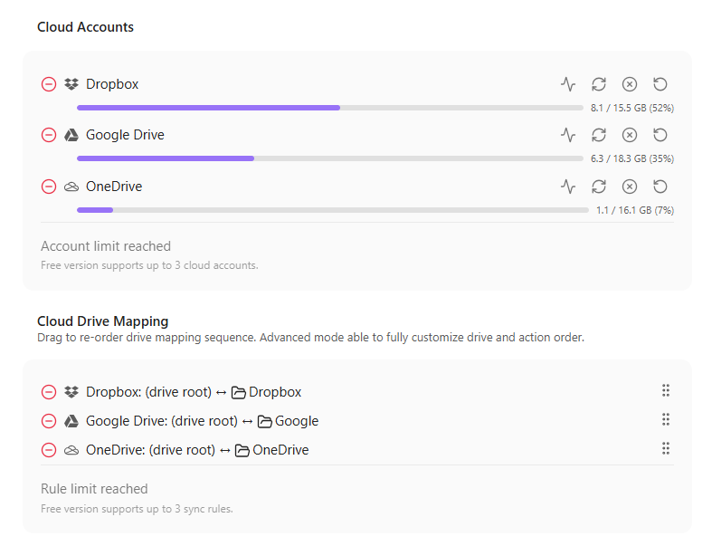
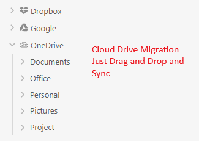

# 🔄 Obsidian MultiSync

> **Sync individual vault folders with multiple cloud drives — simultaneously.**

⚠️ **Disclaimer:** This plugin modifies files in your vault and cloud storage. **Always maintain offline backups.** The author is not responsible for any data loss.

---

## Features

- **Multi-Cloud Sync** — Sync with Dropbox, Google Drive, and OneDrive at the same time
- **Per-Folder Mapping** — Map any vault folder to any cloud drive folder (not the whole vault)
- **Multiple Rules** — Different folders can sync to different providers or accounts
- **Delta Sync** — Only syncs files that actually changed since last sync
- **Ghost Files** — See cloud-only files in the file explorer without downloading them
- **Conflict Detection** — Handles file modification conflicts with smart merge logic
- **Hash Verification** — Prevents false sync operations by verifying content hashes
- **Cloud Migration** — Drag and drop files between mapped folders to migrate between providers
- **Safe Deletion** — Confirmation dialog, cloud trash bin, and local `.trash` folder

---

## Supported Providers

| Provider | Upload | Download | Delete | Delta Sync |
|----------|--------|----------|--------|------------|
| Dropbox | ✅ | ✅ | ✅ | ✅ |
| Google Drive | ✅ | ✅ | ✅ | ✅ |
| OneDrive | ✅ | ✅ | ✅ | ✅ |

More providers coming soon.

---

## Installation

1. Open Obsidian → **Settings** → **Community Plugins**
2. Disable **Safe Mode** if prompted
3. Click **Browse** and search for **"Multi Cloud Sync"**
4. Click **Install**, then **Enable**

### Manual Installation

1. Download `main.js`, `manifest.json`, and `styles.css` from the [latest release](https://github.com/d0uub/obsidian-multisync/releases)
2. Copy them to `<vault>/.obsidian/plugins/multisync/`
3. Restart Obsidian and enable the plugin

---

## Quick Start

1. Open plugin settings
2. **Add a cloud account** (Dropbox, Google Drive, or OneDrive) — authenticate via OAuth
3. **Add a sync rule** — pick a local folder and a cloud folder on that account
4. Click **Sync** (or **Dry Run** first to preview changes)

---

## How It Works

- Each **sync rule** maps a local vault folder ↔ cloud folder on a specific account
- On sync, the plugin compares local files vs cloud files using timestamps, sizes, and hashes
- New/modified files are uploaded or downloaded as needed
- Deleted files are moved to trash (cloud trash + local `.trash`)
- **Ghost files** show cloud-only files in the file explorer so you know what's in the cloud

---

## Safety

| Layer | Description |
|-------|-------------|
| **Sync Preview** | Dry Run mode shows all changes before executing |
| **Confirmation Dialog** | Review uploads, downloads, and deletes before they happen |
| **Cloud Trash** | Deleted cloud files go to the provider's trash bin (recoverable) |
| **Local Trash** | Deleted local files go to Obsidian's `.trash` folder |
| **Hash Verification** | Content hashes prevent unnecessary overwrites |

---

## Author

**Roy**

This plugin was developed through AI-assisted programming.

---

## License

[GPL-3.0](LICENSE)

